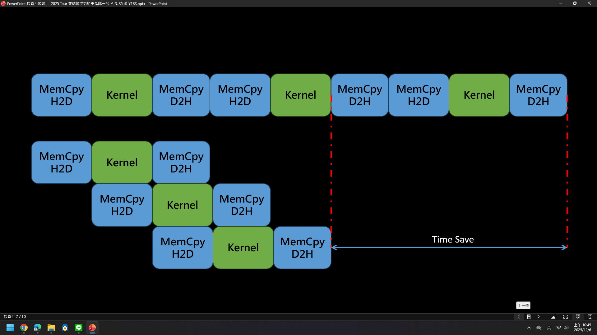

我們已經知道如何將程式放到 GPU 去做計算，若是想要把很多張圖去用 cuda 計算，我們只要把[範例](https://github.com/JrPhy/CUDA/blob/main/CPU2GPU.md#3-%E6%89%8B%E5%8B%95%E5%88%86%E9%85%8D%E7%B5%A6-gpu)再多寫個 for 迴圈在分配記憶體就可以了，但實務上會浪費很多時間在等待
```C++
for (int i = 0; i < numImages; i++) {
    cudaMemcpy(d_in, h_in[i], imgSize, cudaMemcpyHostToDevice);
    rgb2gray<<<grid, block>>>(d_in, d_out, width, height);
    cudaMemcpy(h_out[i], d_out, graySize, cudaMemcpyDeviceToHost);
}
/*Time →
[Memcpy H2D]----[Kernel]----[Memcpy D2H]   (Image 1)
                     ↓
[Memcpy H2D]----[Kernel]----[Memcpy D2H]   (Image 2)
                     ↓
[Memcpy H2D]----[Kernel]----[Memcpy D2H]   (Image 3)
*/
```
上面程式碼會先將記憶體從 host 複製到 device，然後處理圖片一，再把處理完的數據移到 host。此時就可以使用```cudaStream```來做並行處理。

## 1. cudaStream
CUDA Stream 在底層是由 GPU 驅動程式維護的「指令隊列 (command queue)」，每個 stream 對應一個獨立的執行序列。Stream 內的操作按順序執行，不同 stream 的操作則可以由 GPU 的多個執行引擎並行處理，所以可將上方 code 改寫成以下形式來使用
```c++
/* some code */
cudaStream_t streams[numImages];
for (int i = 0; i < numImages; i++) {
    cudaMalloc(&d_in[i], imgSize);
    cudaMalloc(&d_out[i], graySize);
    cudaStreamCreate(&streams[i]);
}

dim3 block(16, 16);
dim3 grid((width + block.x - 1) / block.x,
          (height + block.y - 1) / block.y);
```
假設有 n 張圖片要處理，這邊就開 n 個 streams
```c++
// 使用 stream 並行處理多張圖片
for (int i = 0; i < numImages; i++) {
    cudaMemcpyAsync(d_in[i], h_in[i], imgSize, cudaMemcpyHostToDevice, streams[i]);
    rgb2gray<<<grid, block, 0, streams[i]>>>(d_in[i], d_out[i], width, height);
    cudaMemcpyAsync(h_out[i], d_out[i], graySize, cudaMemcpyDeviceToHost, streams[i]);
}
/*
Time →
Stream 0: [Memcpy H2D]----[Kernel]----[Memcpy D2H]   (Image 1)
Stream 1:       [Memcpy H2D]----[Kernel]----[Memcpy D2H]   (Image 2)
Stream 2:             [Memcpy H2D]----[Kernel]----[Memcpy D2H]   (Image 3)
Stream 3:                   [Memcpy H2D]----[Kernel]----[Memcpy D2H]   (Image 4)
*/
```
注意到這邊使用```cudaMemcpyAsync```而非```cudaMemcpy```，因為 cudaMemcpy 是隱式同步，CPU ***會等***待複製完在去往下執行，cudaMemcpyAsync 則是會把指令放入隊列中，並***不會等*** CPU 複製完才去做下一個指令，就能省下許多時間如下圖所示。\

```c++
// 等待所有 stream 完成
for (int i = 0; i < numImages; i++) {
    cudaStreamSynchronize(streams[i]);
    cudaStreamDestroy(streams[i]);
    cudaFree(d_in[i]);
    cudaFree(d_out[i]);
    delete[] h_in[i];
    delete[] h_out[i];
}
```
因為這邊用了 cudaMemcpyAsync，所以最後要等每個 Stream 同步完後在去做下一步。

## 2. cudaStreamSynchronize
上面程式碼使用了```cudaStreamSynchronize(streams[i]);```，是只等待該 streams 內的任務完成，這樣就可以直接存取 ***i<sup>th</sup>*** 張圖片，不用等到所有 streams 都完成
